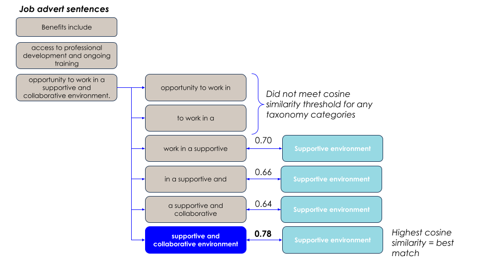

# Matching text to the job quality taxonomy

## Taxonomy development

We conducted an initial analysis to assess (a) which, if any, dimensions of job quality might manifest in job adverts, and (b) what language would be used to express these. We then created a taxonomy that comprised:

- The higher level dimension of job quality, eg “Job design and nature of work”
- Sub-categories within that which were taken from the [CIPD Good Work Index 2023](https://www.cipd.org/globalassets/media/knowledge/knowledge-hub/reports/2023-pdfs/2023-good-work-index-report-8407.pdf) and [Measuring Good Work](https://d1ssu070pg2v9i.cloudfront.net/pex/pex_carnegie2021/2018/09/06105222/Measuring-Good-Work-FINAL-03-09-18.pdf), eg “career progression”, “learning and development”, “sense of purpose”
- The most common phrases that we saw in job adverts that related to these sub-categories. For example, for the sub-category “learning and development”, we included the phrases “CPD” (Continuous Professional Development), “learning and development”, “training”.

You can find the final taxonomy [here](https://open-jobs-lake.s3.eu-west-1.amazonaws.com/job_quality/keywords/keyword_lookup+-+v8.csv).

## Using a different taxonomy

We developed a taxonomy that fit our purposes, but it is possible to use your own taxonomy - though we cannot guarantee performance, as our pipeline has been evaluated against the specific taxonomy we developed. If you wish to use your own taxonomy, the steps that you will need to follow are:

1. Modify the getter function [get_keywords()](https://github.com/nestauk/dap_job_quality/blob/dev/dap_job_quality/getters/keywords.py) so that it points to your taxonomy file. This should be a dataframe (saved as `.csv`, `.parquet` or similar) with the columns `dimension`, `sub_category`, `target_phrase`. `target_phrase` contains the strings that will be embedded and compared to the job advert text.
2. You should evaluate the performance of the pipeline against your taxonomy. This can be done using the scripts in [`dap_job_quality/analysis/mapping_evaluation/`](https://github.com/nestauk/dap_job_quality/blob/dev/dap_job_quality/analysis/README.md) and the notebook [`dap_job_quality/notebooks/Evalution.ipynb`](https://github.com/nestauk/dap_job_quality/blob/dev/dap_job_quality/notebooks/Evaluation.ipynb).

## Mapping approach

The overall approach taken is to chunk up an input sentence into pieces that are then compared to target phrases from a taxonomy.

1. **Initial cleaning**: The input sentence is chunked up into smaller pieces. At first, it is split up on characters that commonly indicate a list, eg ":" (see [`split_text()`](https://github.com/nestauk/dap_job_quality/blob/647565433a4ce21e510de0b574443d516fc5a037/dap_job_quality/pipeline/find_job_quality.py#L91)). Digits are also replaced with 'X' because for our purposes, the exact number is not important: for example, we would like our pipeline to treat "25 days of annual leave" and "30 days of annual leave" as the same.

2. **Sentence chunking**: Then, if the sentence is 6 words or fewer, it is kept whole; otherwise, a rolling window of 4 words is applied. We will refer to these smaller chunks as **ngrams** - mostly they will be 4 words long, but some may be shorter and some may be as long as 6 words.

3. **Embedding**: both the ngrams and the target phrases from the taxonomy are embedded, both using the pretrained model [`all-MiniLM-L6-v2`](https://huggingface.co/sentence-transformers/all-MiniLM-L6-v2). This model was chosen because it is relatively small, optimised for sentence similarity tasks, and has been pretrained on a large corpus of text.

4. **Cosine similarity**: The cosine similarity between the ngrams and the target phrases is calculated. If the similarity is above a certain threshold, the ngram is considered a match to the target phrase.

Different subcategories within the taxonomy have different thresholds:

| Category   | Cosine similarity threshold |
| ---------- | --------------------------- |
| CAREER     | 0.6                         |
| FLEX_HOURS | 0.65                        |
| HOURS      | 0.6                         |
| FLEX_LOC   | 0.6                         |
| LEAVE      | 0.65                        |
| CONTRACT   | 0.5                         |
| LOC        | 0.6                         |
| OTHER      | 0.55                        |

These are intended to optimise for precision vs. recall metrics for each subcategory. See the notebook [`Evaluation.ipynb`](https://github.com/nestauk/dap_job_quality/blob/dev/dap_job_quality/notebooks/Evaluation.ipynb) for plots of precision vs. recall trade-offs at different thresholds for different categories. This notebook also demonstrates that 0.55 is the most reasonable threshold value for categories other than "CAREER", "FLEX_HOURS", "HOURS", "FLEX_LOC", "LEAVE", "CONTRACT" and "LOC", as it is the median of the thresholds for other categories (we focused on "CAREER", "FLEX_HOURS", "HOURS", "FLEX_LOC", "LEAVE", "CONTRACT" and "LOC" for the evaluation because they were prioritised for downstream analysis).

5. **Finding the best match**: Often, multiple ngrams within a sentence will be matched to the same subcategory. In this case, the ngram with the highest cosine similarity is chosen as the best match. This is demonstrated in the figure below:

